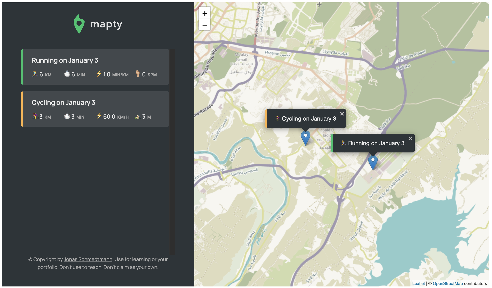

# Javascript Mapty 🗺 Application:

This is an application created following Jonas JavaScript Course in this app we use :

- OOP Es6 Classes
- Inheritance between classes
- Leaflet Map Package

The App Overview :

;

This project is gonna be enhanced soon ...
